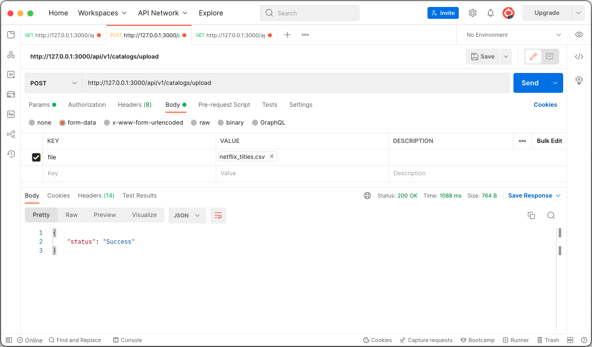
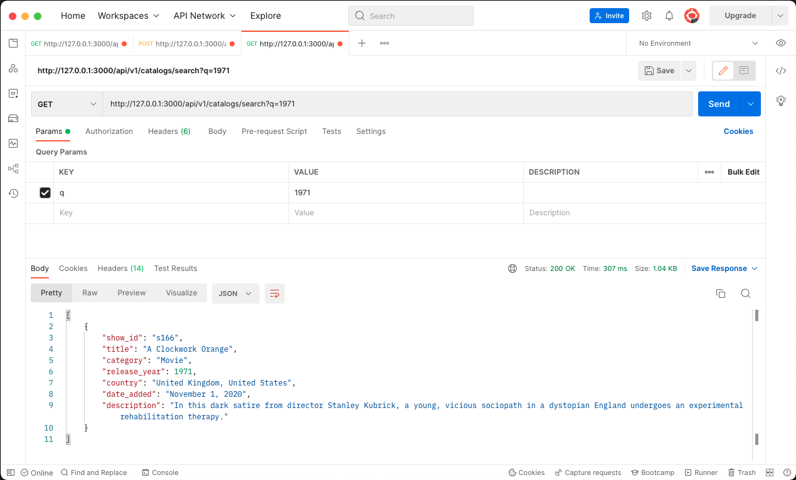

# Movie Catalog

API de serviço do catálogo de filmes. Para isso será necessário criar dois endpoints, um que faça a leitura de um arquivo CSV e crie os registros no banco de dados. E um segundo que liste todos os filmes cadastrados em formato JSON.

## Requisitos

* Ruby 3.1.2

* Rails 7.0.3

* Postman

## Instruções
Clone o repositório:
```
git clone git@github.com:rcleyton/movie_catalog.git
```
Acesse o diretório:
```
cd movie_catalog
```
Rode o bundle
```
bundle install
```
Rode as migrates
```
rails db:migrate
```
Subir o servidor
```
rails s
```

## Endpoints

POST / 

Para fazer a leitura do arquivo csv e persistir os registros em banco:

Método: POST

Rota: http://127.0.0.1:3000/api/v1/catalogs/upload

Em Body: Selecionar form-data, em Key digite file e escolha o tipo File. Em VALUE
carregue o arquivo csv (disponível no diretório public).


Resposta:
```
{
  "status": "Success"
}
```

GET /

Listar os filmes registrados:

Dar um GET na rota http://127.0.0.1:3000/api/v1/catalogs

Resposta:
```
[
  {
    "show_id": "s166",
    "title": "A Clockwork Orange",
    "category": "Movie",
    "release_year": 1971,
    "country": "United Kingdom, United States",
    "date_added": "November 1, 2020",
    "description": "In this dark satire from director Stanley Kubrick, a young, vicious sociopath in a dystopian England undergoes an experimental rehabilitation therapy."
  },
  ...
]    
```
## Filtro
No momento é possível filtar apenas por ano de lançamento ou título.

Dar um GET em http://127.0.0.1:3000/api/v1/catalogs/search

Param **q**

Value: Valor a ser filtrado



## TODO

- [x] Criar lista de filmes
- [x] Listar filmes cadastrados
- [x] Ordenar por ano de lançamento
- [x] Evitar duplicidade ao subir novos filmes
- [x] Filtro simple
- [ ] Filtrar por mais de um parâmetro
- [ ] Escrever testes


